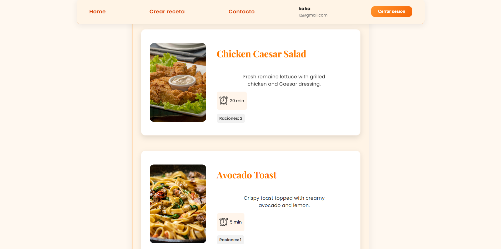
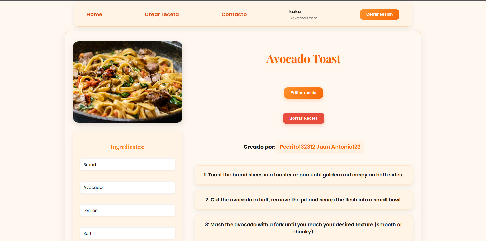
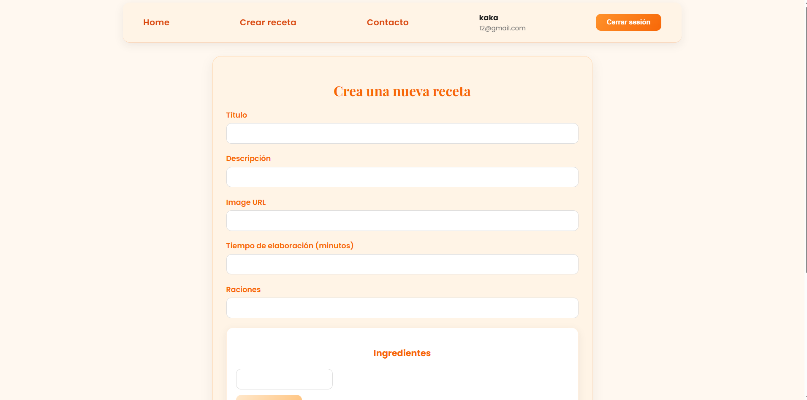

#  Recipe App – Frontend

Frontend for a recipe application developed with **React**, responsible for handling the entire user interface to create, edit, view, and manage recipes.  
It includes user authentication, user profiles, responsive design, and a visual system based on a **custom design system**.

---

##  Technologies Used

- React + Vite
- React Router
- Modular SCSS
- Fetch API
- LocalStorage for authentication
- Custom Design System (variables, typography, colors)

---

##  Project Structure

```bash
src/
│
├── api/
│   ├── userApi.js
│   └── recipesApi.js
│
├── components/
│   ├── Navbar/
│   ├── RecipeComponent/
│   ├── RecipeForm/
│   └── ...
│
├── pages/
│   ├── HomePage/
│   ├── ProfilePage/
│   ├── RecipePage/
│   └── ...
│
├── styles/
│   ├── variables.scss
│   └── global.scss
│
├── main.jsx
```

---

##  Authentication

The frontend handles authentication using **JWT**, storing the token in `localStorage` and sending it with every request to the backend using the following header:

```bash
Authorization: token
``` 

---

##  Main Routes

- `/` – Home  
- `/login` – Login  
- `/register` – Register  
- `/profile/:id` – User profile  
- `/recipe/:id` – Recipe details  
- `/create` – Create recipe  

---

##  Available Scripts

### Install dependencies
```bash
npm install
``` 

### Run in development mode
```bash
npm run dev
``` 

### Build for production
```bash
npm run build
``` 


---

##  Backend Connection

The frontend consumes a **REST API** available at:

```bash
http://localhost:3000/api
``` 

API calls are centralized in the `api/` folder.

---

##  State Management and Logic

- `useState` for forms and local state  
- `useEffect` for API calls  
- Centralized handlers for shared logic  
- Basic form validations  

---

##  Main Routes

### Frontend UI Routes
- `/` – Home  
- `/login` – Login  
- `/register` – Register  
- `/profile/:id` – User profile  
- `/recipe/:id` – Recipe details  
- `/create` – Create recipe  
- `/edit/:id` – Edit recipe  
- `/search` – Search results  

---

### API Routes Used by the Frontend

#### Auth
- `POST /api/auth/signup` – Register user  
- `POST /api/auth/login` – Login user  

#### Recipes
- `GET /api/recipes/:id` – Get recipe by ID  
- `PATCH /api/recipes/edit/:id` – Edit recipe  
- `POST /api/recipes/create` – Create recipe  
- `DELETE /api/recipes/delete/:id` – Delete recipe  
- `GET /api/recipes/paginated?page=x` – Paginated recipes  
- `GET /api/recipes/search?name=x&page=y` – Search recipes  
- `GET /api/recipes/user/:id` – Recipes by user  

#### Users
- `GET /api/users/:id` – Get user  
- `PATCH /api/users/edit/:id` – Edit user  
  

---

##  Images
 ### Home Page 
 ### Recipe Details  
 ### Create Recipe Form 

##  License

Personal project developed by **Víctor Jesús Parras Rumbado**.
